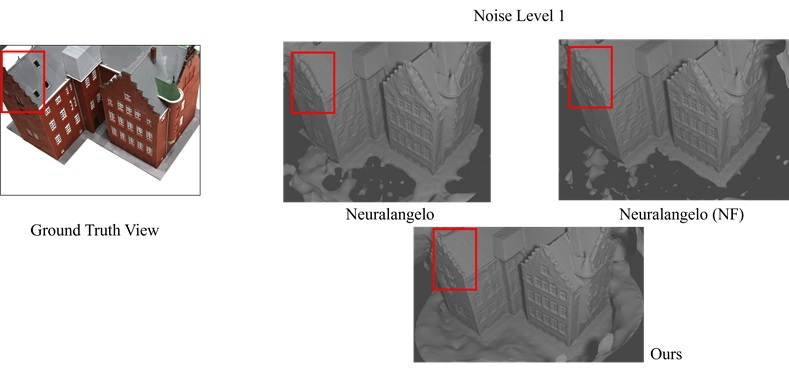
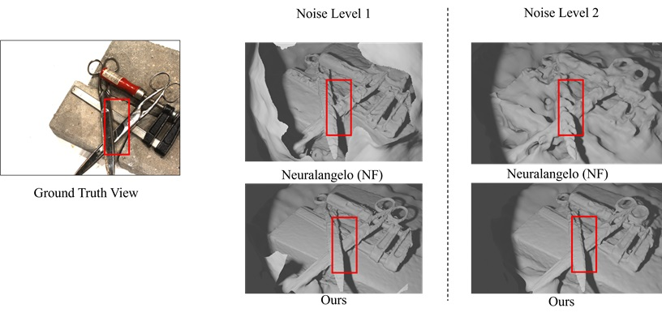
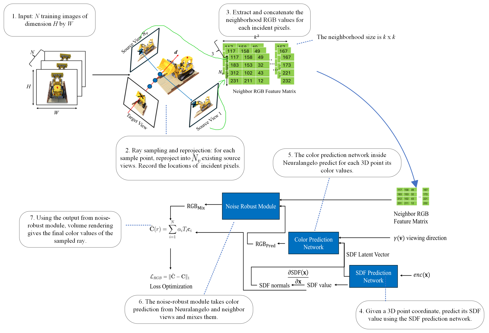

## Noise-Robust Module for Neuralangelo





_This code repository is part of a project report titled_ Degradation-robust neural implicit representation for 3D reconstruction _submitted as partial fulfilment of the requirements of Master of Science in Computer Science by The Chinese University of Hong Kong_. 

### Getting started
1. Setting up the conda environment.  The major environment configuration: Python 3.8.18, CUDA version 11.8, and PyTorch 2.2.0+cu118. Make sure to download and install CUDA 11.8 related tools [here](https://developer.nvidia.com/cuda-toolkit-archive) (choose the link "CUDA Toolkit 11.8.0 (October 2022)"). Afterwards, you can run the following installation commands.
```bash
# Make sure switching to the top-level directoy of this project 
$ conda create -n neuralangelo
$ conda activate neuralangelo
$ conda install -f conda_env_cu118.yml
```

2. Install the `tiny-cuda-nn` Python package. The suggested way is to clone its Github repository and compile from source using CUDA 11.8. You are referred to the [offical repo](https://github.com/NVlabs/tiny-cuda-nn/) of `tiny-cuda-nn` for compilation procedures. But if you have already installed the conda environment as in Step 1, then simply download a pre-compiled Python wheel from [here](https://drive.google.com/file/d/1r_4QwwymOcU8ZWhujQwEHYTOXEtTaBxG/view?usp=drive_link) and run:

```bash
# Make sure `neuralangelo` conda environment is activated, and switching to the directory where the wheel is downloaded 
$ tar -xzf tinycudann-1.7-py3.8-cu11.8-x86_64_whl.tar.gz
$ pip install tinycudann-1.7-cp38-cp38-linux_x86_64.whl
```
3. [Optional.] Download and install the COLMAP software. You are recommended to follow the [official COLMAP documentation](https://colmap.github.io/install.html) to compile from source. I have pre-compiled a binary package (CUDA 11.8, Ubuntu 22.04 (x84_64)) for you to download [here](https://drive.google.com/file/d/13VH6OoE9kBrV_8-00IPif2yVLnHLQdly/view?usp=drive_link), if your machine is compatible with my compilation environment.
```bash
# Make sure switching to the directory where the tar.gz file is downloaded
$ sudo tar -xz -C /usr/ -f colmap-3.9-cu118.tar.gz
```
Then add the following line at the end of your `~/.bashrc` file:
```
export PATH="/usr/bin:$PATH"
```

4. [Optional] Download the dataset and pre-trained models from [here](https://drive.google.com/drive/folders/1e8ehizTqhDj3KTZCLB8YYvEKfGu-M8FL?usp=drive_link). In particular, this projects optimizes a NAFNet model on the simulated level-1 noise, and the model checkpoint can be accessed at `workdir_save/NAFNet/NAFNet-noise1.pth` in the aforementioned shared Google Drive. To use this pre-trained NAFNet model for denoising purposes, I used this [colab notebook](https://colab.research.google.com/drive/1dkO5AyktmBoWwxBwoKFUurIDn0m4qDXT?usp=sharing#scrollTo=6tyWI0qpd89Z) with minor modification to their inference loop (i.e., to make the inference loop iterates through every noisy image under a specified directory).

That's it! You are ready to run the experiments.

### How to run experiments
Note: in the following we use these variables as meta data (i.e., their values are determined by you):   
+ `data_root` refers to the directory of COLMAP pose estimatation result, including a directory "images" for calibrated multi-view images, and a file called "transforms.json" which follows the Neuralangelo convention (for more details, see the official Neuralangelo repo).

+ `image_set_size` is the total number of colmap-calibrated images. These images are normally found under `{data_root}/images`.

+ `train_size` is the number of images in the "images" folder to use in the training. It is supposed to be smaller than `image_set_size`.

+ `log_dir` is the path to where you want to save model checkpoints, tensorboard logs, etc. Usually this should be different for each run in each multi-view scene. 

+ `master_port` is a port number used to launch PyTorch DDP. This variable is needed when you are doing multiple runs of the experiments on one machine (e.g. You are instantiating 3 Neuralangelo instances running on 3 different multi-view image sets). This variable can be set to any available port number on your machine, but it should be unique for each Neuralangelo instance launched on the machine.

#### For pure Neuralangelo, or Neuralangelo (NAFNet)
  + Training.  
  Generate the configuration file using `python projects/neuralangelo/scripts/generate_config.py`. Then add the following fields in the generated configuration file (or change them, if they exist):
  ```yaml
  checkpoint:
    save_iter: 10000 # the period of saving checkpoints. Can be any other value  
  data:
    image_folder_name: images # the folder name of colmap calibrated images, by default it is "images"
    root: {data_root} 
    train:
      subset: {train_size}
    val: 
      subset: {image_set_size - train_size}
    type: projects.neuralangelo.data
  max_iter: 20000 # this was the value used throughout all training runs
  logdir: {log_dir}
  model:
    object:
      sdf:
        encoding:
          hashgrid:
            dict_size: 19
    type: projects.neuralangelo.model
  trainer:
    type: projects.neuralangelo.trainer
  ```
  Then copy the generated configuration file (keep the name as `config.yaml` to `log_dir`, and run  
  ```bash
  torchrun --nproc_per_node=1 --master-port={master_port} train.py --config {log_dir}/config.yaml 
  ```
  + Evaluation/testing.
  ```bash
  torchrun --nproc_per_node=1 --master-port={master_port} eval_rgb.py --config={log_dir}/config.yaml --checkpoint={log_dir}/{checkpoint_name} --dump_dir={log_dir}/eval_rgb
  ```
  Then the evaluation scores for each rendered view will be printed to stdout. In addition, both the ground truth views and rendered views used in evaluation are saved to `{log_dir}/eval_rgb`.


#### Neuralangelo with noise-robust module
  + Training
  Generate the configuration file using `python projects/neuralangelo/scripts/generate_config.py`. Then add the following fields in the generated configuration file (or change them, if they exist):

  ```yaml
  checkpoint:
    save_iter: 10000 
  data:
    image_folder_name: images 
    root: {data_root} 
    train:
      subset: {train_size}
    val: 
      subset: {image_set_size - train_size}
    type: robust.robust_dataset
  max_iter: 20000 
  logdir: {log_dir}
  model:
    object:
      sdf:
        encoding:
          hashgrid:
            dict_size: 19  
    type: robust.robust_model
  trainer:
    type: robust.robust_trainer
  ```
  Then copy the generated configuration file (keep the name as `config.yaml` to `log_dir`, and run  
  ```bash
  torchrun --nproc_per_node=1 --master-port={master_port} train.py --config {log_dir}/config.yaml 
  ```
  + Evaluation/testing  
  ```bash
  torchrun --nproc_per_node=1 --master-port={master_port} eval_rgb.py --config={log_dir}/config.yaml --checkpoint={log_dir}/{checkpoint_name} --dump_dir={log_dir}/eval_rgb --nan
  # "checkpoint_name" is the name of the saved checkpoint 
  ```
  You can find the evaluation scores, the ground truth views and rendered views used in evaluation in the same way as the last sub-section.

### Model architecture




### Customized scripts

[eval_rgb.py](./eval_rgb.py)  
<details span>
This is a script that can load a pretrained Neuralangelo model and output pairs of a source RGB image and RGB image rendered from same viewing direction as the source image. It also outputs a camera pose matrix (compressed .npz file) associated with that rendered RGB image.   

<b> How to run it</b>  
Depending on the method type you choose, this script takes different command line arguments. Please refer to [How to run the experiments](#how-to-run-experiments) section for instructions. The following is further explanation about what this script does.

At the current stage, it is required that before executing this script, the same set of RGB images & `transforms.json` that was used to train the Neuralangelo model must be present. This can be configured by setting `data.root` in the Neuralangelo configuration file or by `--data.root` command line argument.

```yaml
checkpoint:
  ...
cudnn:
  ...
data:
  image_folder_name: images 
  root: /path/to/train/data <== Set this
  ...
```

Note that for Neuralangelo trained on noisy images, the `data.image_folder_name` field is the name of the folder containing noisy images (e.g., "images_noise1"), while during evaluation this is the name of the folder containing clean images (i.e., "images"). This is because during training with noisy images, a ground truth image IS a noisy image, while during evaluation, we should compare the rendered view with a clean image.

<b>The output format</b>  
By default, the script will assign an interger id (starting from 0) to the output file each time an image is rendered from a viewing direction. So the names of outputs will be:

| Type of file | File name |
| -- | -- |
|Rendered RGB image | rendered_rgb_{id} |
|Training RGB image with the same viewing direction | gt_rgb_{id} |
|Camera pose matrix | pose_{id}.npz |

Remark: you can obtain the camera pose matrix by `numpy.load("pose_{id}.npz")["pose"]`. You can control how many images are rendered from model and the rendered image resolution by modifying the following config values in Neuralangelo configuration file.

```yaml
data:
    val:
        batch_size: 2   
        image_size:
        - 300 <== rendered image height
        - 400 <== rendered image width
        max_viz_samples: 16
        subset: 4 <== number of rendered images you want
```
</details>

[image_noise.py](./robust/image_noise.py)
<details span>

This script was used to add simulated noise to clean multi-view images. By default it will write out images with two levels of noise (with noise parameters hard-coded in this script) into two folders called `images_noise1` and `images_noise2`. If you want to apply it to your own dataset, make sure to set properly the `scene_roots` variable in the script, or you can run the script and provide the `--root` command line argument. Note: Run `python ./robust/image_noise.py --help` to see more of its usage.
</details>

### Credit

This repo borrows code from the following two github repository: [**Neuralangelo: High-Fidelity Neural Surface Reconstruction**](https://github.com/NVlab/neuralangelo) and [**NAN: Noise-Aware NeRFs for Burst Denoising**](https://github.com/NaamaPearl/nan). To give credit, the following are the Bibtex citations of their papers.

```text
@inproceedings{li2023neuralangelo,
   author = {Li, Zhaoshuo and Müller, Thomas and Evans, Alex and Taylor, Russell H and Unberath, Mathias and Liu, Ming-Yu and Lin, Chen-Hsuan},
   title = {Neuralangelo: High-Fidelity Neural Surface Reconstruction},
   booktitle = {Proceedings of the IEEE Conference on Computer Vision and Pattern Recognition (CVPR)},
   pages = {8456-8465},
   year = {2023},
   type = {Conference Proceedings}
}

@inproceedings{pearl2022nan,
   author = {Pearl, Naama and Treibitz, Tali and Korman, Simon},
   title = {Nan: Noise-aware nerfs for burst-denoising},
   booktitle = {Proceedings of the IEEE Conference on Computer Vision and Pattern Recognition (CVPR)},
   pages = {12672-12681},
   year = {2022},
   type = {Conference Proceedings}
}

```


